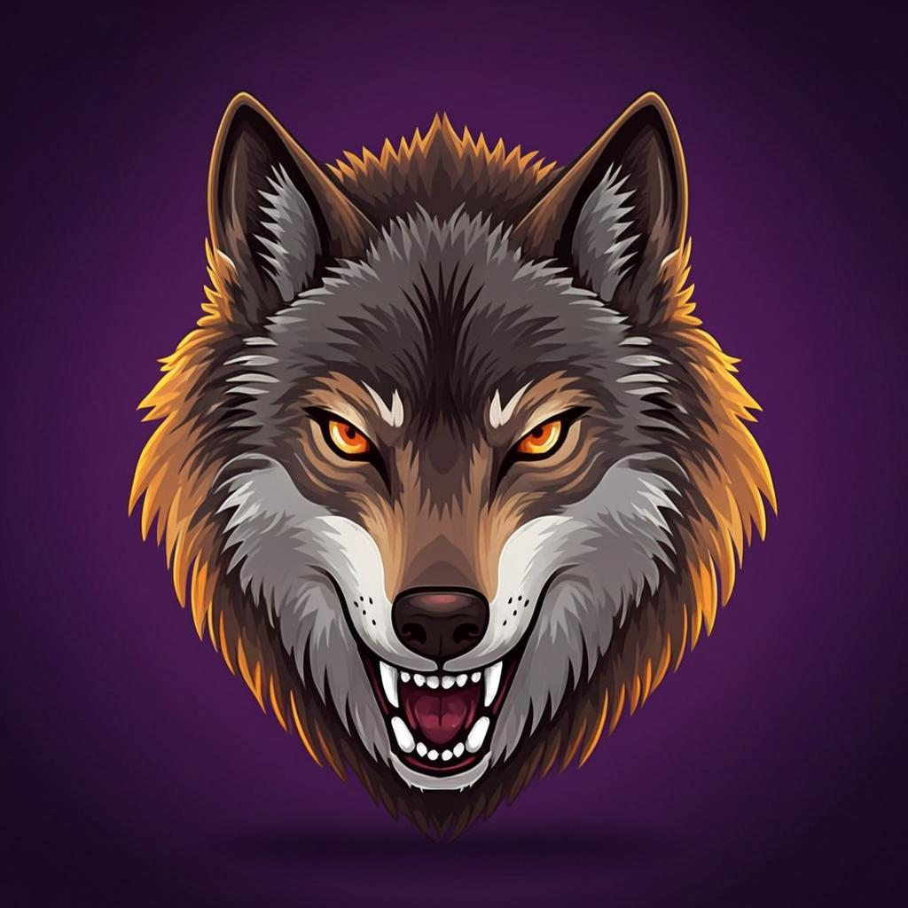

# 🐺 Lycon Browser

> *Browse wild. Browse free.*

A privacy-first web browser inspired by Brave, with a fierce wolf mascot.
Built on a **shared web UI** that runs unchanged inside three native shells:
Electron (desktop), WinUI 3 + WebView2 (Windows), and Kotlin + GeckoView (Android).



## Three platforms, one UI

```
                   ┌─────────────────────────────┐
                   │  Shared UI bundle (src/)    │
                   │  HTML / CSS / Vanilla JS    │
                   │  Talks to bridge contract   │
                   └──────────────┬──────────────┘
                                  │
            ┌─────────────────────┼─────────────────────┐
            │                     │                     │
   ┌────────▼────────┐  ┌─────────▼─────────┐  ┌───────▼─────────┐
   │   Electron      │  │   WinUI 3 +       │  │   Kotlin +      │
   │   (dev/test)    │  │   WebView2        │  │   GeckoView     │
   │                 │  │                   │  │                 │
   │  preload.js →   │  │  LyconBridge.cs → │  │  LyconBridge.kt │
   │  window.lycon   │  │  window.lycon     │  │  → window.lycon │
   └─────────────────┘  └───────────────────┘  └─────────────────┘
        Linux/mac/         Windows .exe           Android .apk
        Windows .exe       (MSIX install)         (Play Store .aab)
```

## Status

| Platform | Status | Tests |
|---|---|---|
| Electron (desktop) | ✅ Production-ready | **26/26 E2E tests pass** |
| Windows (WinUI 3 + WebView2) | ✅ Reference project complete | Manual build in VS 2022 |
| Android (Kotlin + GeckoView) | ✅ Reference project complete | Manual build in Android Studio |

## Project structure

```
lycon-browser/
├── main.js                    # Electron main process
├── preload.js                 # Electron preload — exposes __lyconNative
├── package.json               # Electron + adblocker deps
├── sync-ui-bundle.sh          # Sync src/ → both platform asset folders
├── BRIDGE_CONTRACT.md         # The __lyconNative API contract
├── INTEGRATION.md             # Step-by-step merge guide for existing apps
│
├── src/                       # Shared UI bundle (platform-agnostic)
│   ├── index.html             # Browser chrome shell
│   ├── startpage.html         # New-tab page (wolf logo + search + shortcuts)
│   ├── bridge/
│   │   └── bridge.js          # Wraps __lyconNative into window.lycon
│   ├── js/                    # UI modules (state/tabs/nav/shields/...)
│   ├── styles/                # CSS (themes/main/tabs)
│   └── assets/
│       └── wolf-logo.png      # Claire the wolf (AI-generated)
│
├── windows/                   # WinUI 3 + WebView2 project
│   ├── LyconWindows.sln       # Open in Visual Studio 2022
│   ├── README.md
│   └── LyconWindows/
│       ├── LyconWindows.csproj
│       ├── App.xaml / App.xaml.cs
│       ├── MainWindow.xaml / .cs    # WebView2 host + nav/download handlers
│       ├── LyconBridge.cs           # JS↔native bridge
│       ├── LyconDataService.cs      # JSON persistence
│       ├── LyconShieldsService.cs   # EasyList URL blocker
│       ├── Package.appxmanifest
│       └── Assets/
│           ├── lycon-ui/            # Copy of src/ (run sync-ui-bundle.sh)
│           └── *.png                # Tile + store icons
│
├── android/                   # Kotlin + GeckoView project
│   ├── settings.gradle.kts    # Open in Android Studio
│   ├── build.gradle.kts
│   ├── README.md
│   └── app/
│       ├── build.gradle.kts
│       ├── proguard-rules.pro
│       └── src/main/
│           ├── AndroidManifest.xml
│           ├── java/com/lycon/browser/
│           │   ├── MainActivity.kt          # GeckoView host + prompt delegate
│           │   ├── LyconBridge.kt           # JS↔native bridge via prompt()
│           │   ├── LyconDataService.kt      # JSON persistence
│           │   └── LyconShieldsService.kt   # GeckoView tracking protection
│           ├── assets/
│           │   └── lycon-ui/                # Copy of src/ (run sync-ui-bundle.sh)
│           └── res/                         # Layouts, drawables, themes
│
├── tests/                     # E2E test suite (Electron-based)
│   ├── run-tests.js           # Test harness — launches Lycon, drives UI
│   ├── run-all-tests.sh       # Xvfb wrapper for headless runs
│   └── *.test.js              # 6 test suites
│
├── build/                     # Wolf logo + icon assets
│   ├── wolf-logo-final.png    # 1024x1024 source
│   ├── icon.png               # 512x512 main
│   ├── icon.ico               # Windows
│   ├── icon.icns              # macOS
│   └── icon-{16..1024}.png
└── README.md                  # This file
```

## Quick start

### Desktop (Electron) — fastest way to try Lycon

```bash
cd lycon-browser
npm install
npm start
```

On Linux containers / WSL:
```bash
npx electron . --no-sandbox --disable-gpu --disable-dev-shm-usage
```

### Windows native app

1. Open `windows/LyconWindows.sln` in Visual Studio 2022 (17.10+).
2. Build as `x64`.
3. Press F5 to run.

See [windows/README.md](windows/README.md) for details.

### Android app

1. Open the `android/` folder in Android Studio (Hedgehog+).
2. Let Gradle sync (downloads GeckoView, ~50MB, one-time).
3. Connect an Android device (API 24+) or start an emulator.
4. Press Run.

See [android/README.md](android/README.md) for details.

### Sync the UI bundle after edits

After modifying `src/`, push the changes to both platform projects:

```bash
./sync-ui-bundle.sh
```

## Features

All three platforms share the same UI feature set:

| Feature | Status |
|---|---|
| Multi-tab browsing (drag-reorder / pin / mute / duplicate) | ✅ |
| Right-click tab context menu | ✅ |
| Smart URL bar (URLs vs. search queries) | ✅ |
| Security indicator (🔒 HTTPS / ℹ️ info / ⚠️ HTTP warning) | ✅ |
| **Lycon Shields** — ad + tracker blocking (per-tab counter) | ✅ |
| **HTTPS-Only Mode** (auto-upgrade HTTP→HTTPS) | ✅ |
| Bookmarks (add/remove/search) | ✅ |
| History (searchable, clearable) | ✅ |
| Download manager (live progress) | ✅ |
| Private mode (separate session) | ✅ |
| Find in page (Ctrl+F) | ✅ |
| Theme picker (dark/light/system + 3 accents) | ✅ |
| Custom wolf-themed start page | ✅ |
| Window state persistence | ✅ |
| Built-in PDF viewer | ✅ (Electron + WinUI) |
| DevTools (F12) | ✅ (Electron + WinUI) |
| Screenshot tool | ✅ |
| Search engine picker (Brave / DuckDuckGo / Google / Bing / Startpage) | ✅ |

## Bridge architecture

The shared UI bundle is **platform-agnostic**. It does NOT call Electron's
`ipcRenderer`, WinUI's `chrome.webview`, or GeckoView's `WebMessageDelegate`
directly. Instead, it expects a single global object — `window.__lyconNative` —
to be provided by the host **before** `src/bridge/bridge.js` loads.

`bridge.js` then wraps `__lyconNative` into the high-level `window.lycon` API
used by all UI modules.

| Platform | How `__lyconNative` is provided |
|---|---|
| Electron | `preload.js` via `contextBridge.exposeInMainWorld` |
| WinUI 3 | `AddScriptToExecuteOnDocumentCreatedAsync(bridgeScript)` |
| GeckoView | `session.promptDelegate` intercepts `window.prompt()` |

See [BRIDGE_CONTRACT.md](BRIDGE_CONTRACT.md) for the full API reference.

## Testing

The E2E test suite runs against Electron but exercises the same shared UI
that ships on all three platforms — so passing tests give confidence the
bundle works on WinUI and Android too.

```bash
./tests/run-all-tests.sh
```

| Test | Pass | Description |
|---|---|---|
| `navigation` | 3/3 | Loads example.com, wikipedia.org, github.com |
| `single-tab` | 1/1 | Minimal single-tab smoke |
| `keyboard` | 6/6 | Ctrl+T, URL bar typing, Ctrl+Tab, Ctrl+W, Ctrl+F |
| `bookmarks-history` | 4/4 | Bookmark CRUD + history tracking + clear |
| `downloads` | 8/8 | Real file download via local server |
| `shields` | 4/4 | Ad-blocker blocks 14 requests on theverge.com |

**Total: 26/26 assertions pass.**

Reports: `/home/z/my-project/download/lycon-tests/test-report.json`

## Tech stack

- **Shared UI**: HTML / CSS / Vanilla JS (no framework, no build step)
- **Desktop**: Electron 33 + Chromium + `@cliqz/adblocker-electron`
- **Windows**: WinUI 3 (.NET 8, C#) + WebView2 + Newtonsoft.Json
- **Android**: Kotlin + GeckoView (Firefox engine) + built-in tracking protection
- **Wolf mascot**: AI-generated, refined through 5 VLM critique rounds

## License

MPL-2.0 — same license as Brave's core components.

## Credits

Wolf mascot "Claire" designed via AI image generation with VLM-guided
refinement. Filter lists maintained by the EasyList / Ghostery / Disconnect
communities.
